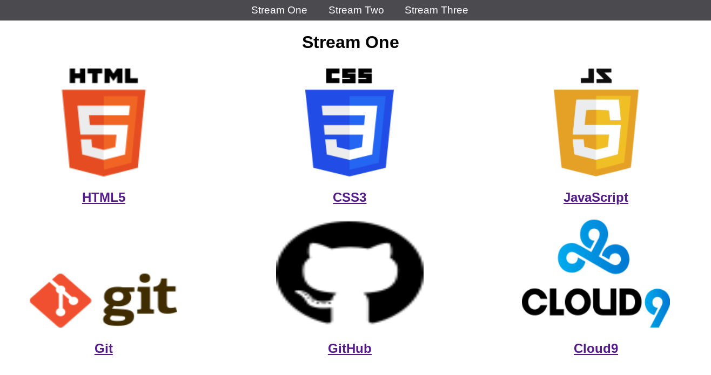

# first-repo - A simple site linking to information about different web development tools. 

The site was created as part of a training course in front-end development. 
It has three pages of links that, via logos and names, take the user to the corresponding Wikipedia page, 
where they can gain more information on the specific development tool. 
There are six links per page, with some repeating on across pages. The reason for repeating the links 
was to practice where pieces of code can be copied and reused during a single project,  
allowing the whole process be more efficient while keeping a sense of uniformity across the site. 

 

# Technologies used 

### HTML5 (hyper-text markup language) 
HTML is a programming language used for structuring and presenting content on the world wide web. 
This was used for the bulk of the project. 

### CSS (Cascading Style Sheets) 
CSS is a style sheet language used for describing the presentation of a document 
written in a markup language such as HTML. 
This was used to make the site look more appealing for a better user experience via logos,  
colour and spacing etc. 